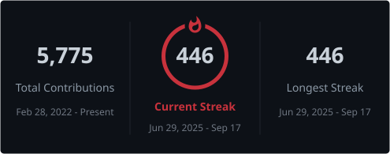

  

<h3 align="center">𝐄 𝐍 𝐌 𝐀 𝐍 𝐔 𝐄 𝐋 &nbsp; 𝐓 𝐎 𝐑 𝐑 𝐄 𝐒</h3>

<h4 align="center">◇ &nbsp; Software Engineer &nbsp; ・ &nbsp; Nicaragua &nbsp; ・ &nbsp; UTC−6 &nbsp; ◇</h4>

  

 

<h2>「 About 」⤸</h2>

<table width="100%">
<tr>
<td width="330" align="center">
  
</td>
<td valign="top">
   
  
I like problems that already have a history.

  

    Greenfield is fun for about a week. What actually holds my attention is the system somebody
    built under deadline six years ago that now runs half a business and falls over every Tuesday —
    finding out why, then moving it forward a decade without stopping the music.
  

  

    Lately that has meant a lot of payments work. Money has to arrive, in full, exactly once.
    It cures you of trusting the happy path.
  

  

    <code>Java</code> &nbsp; <code>Go</code> &nbsp; <code>TypeScript</code> &nbsp;
    <code>GraphQL</code> &nbsp; <code>Spring</code> &nbsp; <code>React Native</code>
  

</td>
</tr>
</table>

<h2>「 Currently 」⤸</h2>

<table width="100%">
<tr>
<td valign="top">
   
  

    <b>Axiom</b> &nbsp; <code>solo</code> 
    A school management SaaS I am building alone under the Vanter name. Nights and weekends.
    The one that is actually mine.
  

   
  

    <b>Payments, full time</b> &nbsp; <code>day job</code> 
    Third-party integrations, KYC flows, GraphQL federation. Backend one week,
    React Native the next.
  

   
  

    <b>Reading more than I ship</b> &nbsp; <code>ongoing</code> 
    Distributed systems papers, other people's migration post-mortems, and the occasional
    manga that has nothing to do with any of it.
  

   
</td>
<td width="330" align="center">
  
</td>
</tr>
</table>

 

  

 

<h2 align="center">୨ ・ Stack ・ ୧</h2>

 

  

  

Plus the ones nobody puts on a profile &nbsp;·&nbsp; <code>WebSphere</code> &nbsp; <code>IBM MQ</code> &nbsp; <code>Db2</code> &nbsp; <code>JD Edwards</code> &nbsp; <code>SVN</code>

  

<h2 align="center">୨ ・ Stats ・ ୧</h2>

 

  

  

  

 

<h3 align="center">𝐄 𝐒 𝐏 &nbsp; ・ &nbsp; 𝐄 𝐍 𝐆</h3>

<h3 align="center">「 Thanks for reading 」</h3>

Open to interesting problems

 
